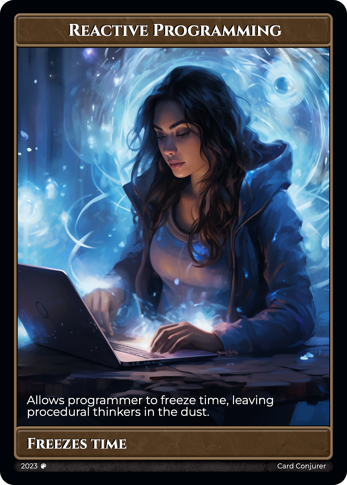
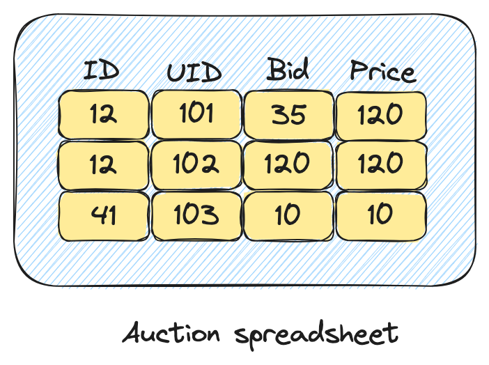

My TV lags. It's driving me crazy. Whenever I touch my remote, I have
to refresh. The same is true about my laptop: I find myself hitting
refresh all the time. What about my phone? Same story. And if I lose
the network? Don't get me started on that.

Why can't it just work? Why do I have to refresh? Ever? Everything is
connected these days. Everything should be kept in sync at all times.
We have the hardware to do it, so why don't we?

The answer is simple. We simply don't have the tools to do it. To keep
things in sync the client would have to send updates to the server,
the server would have to do the same with its services and eventually
circle back to the client. That's a lot of updates! It's a sea of
updates! And unfortunately, we don't have the tools to navigate that
sea.

## Messages

Our industry is obsessed with messages. You can find all sorts of
tools to work with streams of messages. You can do it in any language,
on the platform of your choosing.

But messages are just a mean to an end. Of course, any app using the
network will have to send messages at some point. But if your strategy
involves sending messages from point A to point B, while trying to
devise the logic to update your state, you are going to get it
wrong. Why?  Because changing your state is tough. It has been known
to be tough for a long time. It's called cache invalidation.


## Cache Invalidation (aka: the programmer's nightmare)

Imagine you are the one writing the code that invalidates the
caches. So what can you do? Well, there isn't much to do ... and
that's where the problem lies.

To effectively program the cache invalidation logic, you need to hold
all the possible states of the program in your head. In a distributed
system, the problem multiplies, as you have to manage states across
multiple machines.

Clearly, this is an impossible task, and that's why cache invalidation
has such a bad reputation. So what's the solution? The solution is to
think about the problem differently.

## The Magic of Spreadsheets

Ever wondered why spreadsheets are so popular? Their secret is their
declarative nature. Users simply establish links between cells, and
updates are taken care of automatically. Reactive programming is an
extension of the spreadsheet concept. You write your logic as if the
program was initializing, pretending time was frozen. When something
changes, the system figures out the shortest way to move from the old
to the new state.

React.js, another instance of reactive programming, works the exact
same way. Your job is to write the rendering logic pretending the
program was initializing, the rest is taken care of for you. Whether
you are writing a formula in a spreadsheet, or writing the rendering
function of a react app, what you are doing in both cases is
pretending that the program is initializing, ignoring changes: **you
are pretending that time is frozen**. That's **Reactive Programming
(RP)**.

This concept is very powerful because it makes state management
tracktable. Remember cache invalidation? What if all your caches were
defined with RP? Your caches would update automatically. Isn't that
exactly what we want? Why stop there?  What if we extended the
principles of Reactive Programming to other domains, like distributed
systems? With networks full of race conditions and concurrent updates,
they seem like a prime candidate for reactive programming.

Turns out, that's precisely what we're aiming to achieve at
[SkipLabs](https://skiplabs.io/). But before we get into that, let's
take an example.

## An Example

Your friend has an online store selling magic the gathering cards. He
is using typical e-commerce web based solution. Although the site is
popular, he realizes that some of his cards are very rare, and that he
would be better off by auctioning them. He comes to you, asking what
it would take to add an auctioning system to his website, but there is
a catch: he doesn't want people to have to constantly hit refresh for
the prices to update.

You immediately start thinking about it. What happens when a user is
bidding? We send a message to the server, the server then updates the
price, and then ... That's it! You are doing it again! You are
thinking in terms of messages and updates. Stop right there. You are
doing it wrong. Time to use our newly acquired magic power.



Let's forget about the network for a second. What would your auction
system look like if it was a spreadsheet running on just one machine?
You would have 4 columns: itemID/userID/bid/price where the price is a
formula computing the highest bid. Because it's a spreadsheet,
everytime a new bid is inserted, the price updates accordingly. Pretty
easy right?

Let's imagine you were given a new kind of spreadsheet, one where you
can mirror columns across the network, and have those columns kept in
sync for you.

How would you your auction system work? You would mirror the first 3
columns with clients willing to bid (writers) and you would mirror the
last columns for clients who want to know the highest bidder
(readers). Your system would look something like this:



Unfortunately, such a spreadsheet does not exist (yet ;)), but we developed a tool at
SkipLabs to do the exact same thing using SQL: it's called [SKDB](http://skdb.io).

The way our example would work (assuming we are using the JS client),
would by first setting up a table containing the bids:


```JS
skdb.server().sql('create table bids (itemID INTEGER, userID INTEGER, bid INTEGER);')
```

And then by creating a virtual view (the moral equivalent of a formula):

```JS
```