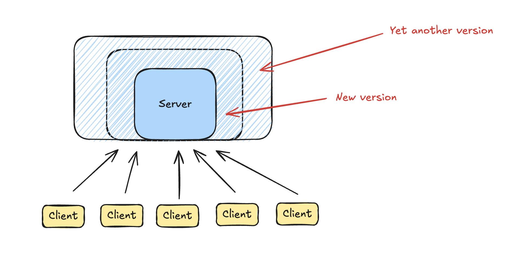
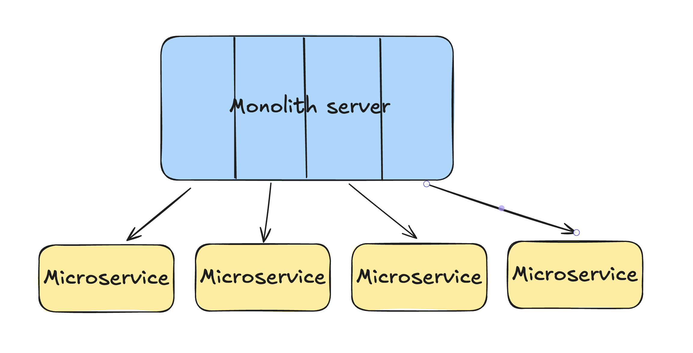
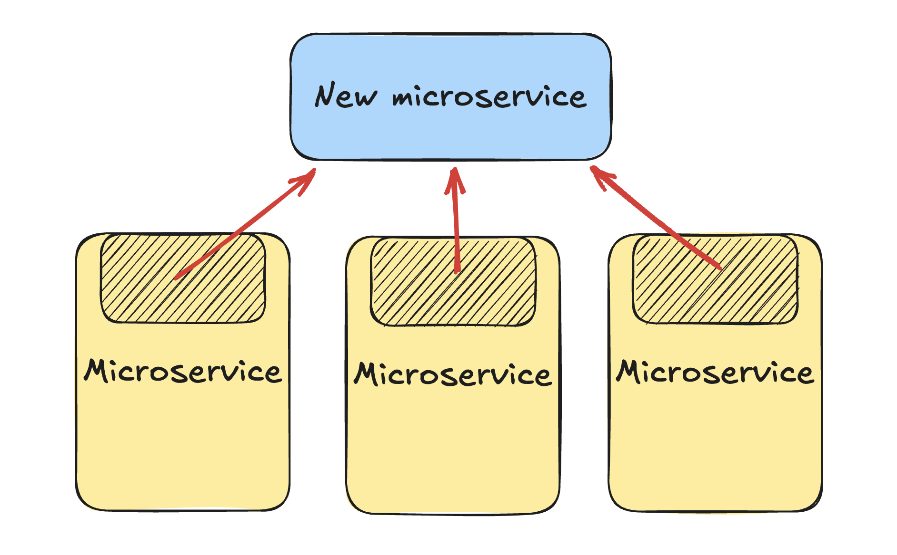
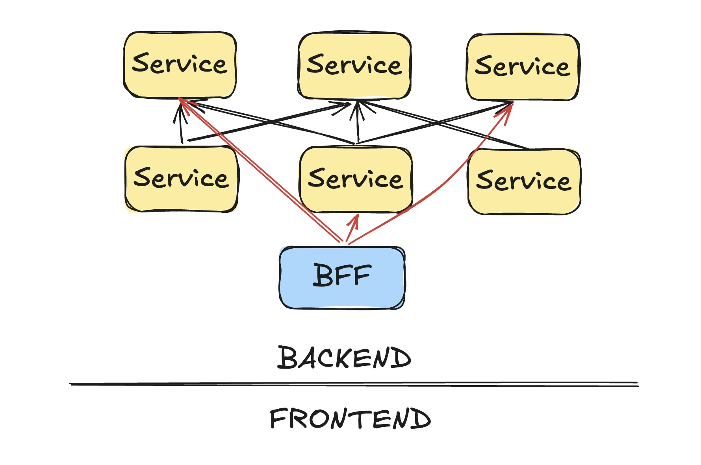
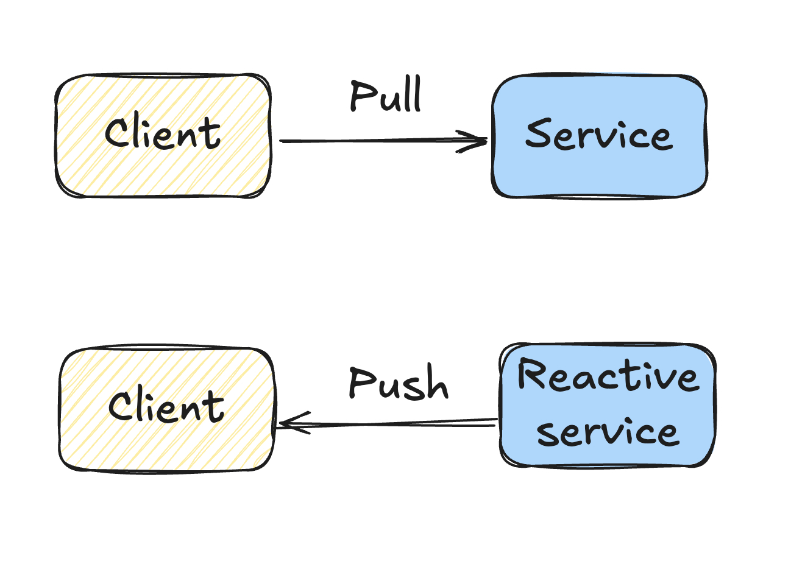

### Understanding Microservices: A Developer's Perspective

What exactly is a microservice architecture, and how does it compare
to traditional approaches like monolithic architectures? Let’s break
it down in simple terms.

#### The Traditional Monolithic Architecture

Before diving into microservices, it's essential to understand what a
typical monolithic architecture looks like. In a monolithic setup, you
have a client interacting with a single, large server. This server
handles everything—processing requests, interacting with the database,
and executing all the business logic. It’s a one-stop-shop for your
application’s backend.

While this approach works well initially, as your application grows,
so does the complexity. All your code is bundled together, making it
harder to manage and scale. Eventually, this can lead to slower
development cycles, as teams have to navigate through large,
intertwined codebases. This is usually when companies start thinking
about microservices.

#### Transitioning to Microservices

Microservices come into play when a monolithic system becomes too
complex to manage. Instead of one large application, microservices
break it down into smaller, independent services. Each service handles
a specific piece of functionality and can be developed, deployed, and
scaled independently.

For example, in a monolithic architecture, you might have one giant
application handling user authentication, product catalogs, and
payment processing. In a microservice architecture, these would be
separate services, each with its own database and API.

This separation not only makes it easier for teams to work
independently but also allows the system to scale more efficiently.

#### Horizontal vs. Vertical Scaling

When you split a monolith into microservices, there are two main ways
to approach it: horizontal scaling and vertical scaling.

##### Horizontal Scaling

This is the easier method, where you take different APIs or endpoints
from your monolith and turn them into separate services. For example,
you might break up a single large API into smaller, focused services,
each responsible for a specific part of your application.

While horizontal scaling simplifies development, it can make
discoverability a challenge. As the number of services grows, it
becomes harder to find the right one. This requires good documentation
and organizational discipline to manage.

##### Vertical Scaling

This approach involves consolidating shared logic into a separate
service. For instance, if several services need to calculate a user’s
score for rating movies, you might create a dedicated service for this
task.

Unfortunately, vertical scaling introduces latency, as services now
have to wait for responses from other services. Techniques like
asynchronous programming and caching can help mitigate some of this
latency, but they introduce their own complexities and trade-offs.

#### Dealing with Latency and Dependencies

Latency is one of the biggest challenges in a microservices
architecture. When services depend on each other, you end up with a
chain of dependencies where each service must wait for the previous
one to respond. This can slow down your application.

To combat this, developers often use caching, where data is
temporarily stored to avoid repeated calls to a service. However,
caching comes with its own trade-offs, such as stale data and memory
overhead.

Another significant issue is **cascading failures**. In a microservice
architecture, if one service fails, it can cause a ripple effect,
leading to multiple services timing out or crashing, potentially
bringing down the entire system.

#### Debugging Microservices

Debugging in a microservice architecture is notoriously
difficult. Unlike a monolithic system where everything runs on a
single machine, microservices are distributed across multiple
machines, making it hard to get a complete picture of what’s
happening. You can’t just take a snapshot of the whole system’s
state. Instead, you often have to rely on extensive logging and spend
hours piecing together logs from different services to understand what
went wrong.

#### The Complexity of Changing Microservices

One of the selling points of microservices is agility—the ability to
make changes quickly. However, this is only true if you don’t need to
change the system's overall structure. If you need to modify how
services interact, it can become a complex and time-consuming
task. Adding a new service or changing dependencies between services
often requires significant effort and can introduce new points of
failure and latency.

#### The Frontend Developer's Dilemma

Frontend developers often face the most challenges with
microservices. They need data from multiple services to build new
features or views, which can mean interacting with numerous teams and
APIs. This can be slow and frustrating, especially if those services
weren’t designed with the frontend’s needs in mind. This has led to
the concept of **backend-for-frontend (BFF)**, where a dedicated
backend service aggregates the necessary data for the frontend.

However, this BFF approach adds more complexity to the system,
creating yet another service that needs to be maintained and scaled.

### Enters reactive services

Microservices can greatly improve scalability and flexibility in your
system, but they come with significant challenges, including increased
latency, debugging complexity, and potential for cascading
failures. They work best when the overall architecture remains stable
and services don’t need to change frequently.

Now, let's dive into a related concept—**reactive services**—and how
they can help address some of these issues while enabling real-time,
efficient systems.

#### What Are Reactive Services?

At its core, a reactive service differs from a traditional service in
how it communicates with clients. In a typical service, the client
sends a request, waits for a response, and then closes the
connection. Reactive services flip this model by keeping the
connection open after the initial response, allowing the service to
push updates to the client whenever there’s a change. This approach is
particularly useful in scenarios where you need real-time updates or
want to reduce latency in a complex system.

#### Why Use Reactive Services?

Reactive services are valuable for two main reasons:

##### Real-Time Experiences

In applications like real-time collaboration tools, gaming, or live
data feeds, you need the client to be immediately aware of any
changes. For instance, in a chess game, when one player makes a move,
the other player should see that move instantly without refreshing the
page or constantly polling the server for updates. Reactive services
enable this seamless experience by pushing updates to the client as
soon as they occur.

##### Improving Latency in Microservices

As we discussed earlier, one of the main pain points in microservices
is the accumulation of latency across multiple layers. By converting a
service into a reactive one, you can maintain a reactive cache of
needed data within your service. This means that instead of fetching
data with each request and paying the associated network latency, your
service can instantly access the data it needs from a local,
up-to-date cache.

##### Taming complexity

Reactive services can help tame the complexity of a
microservice architecture by allowing you to create reactive services
that act like "views" over the data of other services. These reactive
views are maintained automatically, staying up-to-date with the latest
changes from the underlying services. This approach simplifies the
architecture by reducing the need for complex data orchestration
between services, and because the views are reactive, they stay
current without introducing additional latency.

#### How Reactive Views Works

Consider a service that provides movie recommendations by calculating
a score for each user-movie pair. In a traditional setup, each time
the service needs to display these scores, it must fetch the data from
a remote service, introducing latency.

With a reactive service, however, you can define a subset of the
data—such as all movie scores for a specific user—and store it in a
reactive view. This cache is constantly updated by the reactive
service whenever any of the scores change. As a result, when your
service needs to display a score, it can retrieve it directly from the
cache, effectively reducing the latency to zero.

This approach works well in cases where you can clearly define the
subset of data you need. However, it’s not always applicable. For
example, in a search function where the data required is
unpredictable, maintaining a complete cache of all possible results
would be inefficient.

#### Building Reactive Services with Streaming

One of the traditional ways to build reactive services is by using
**streaming**. In a streaming model, changes in data are represented
as streams of events. Each time an event occurs, it gets pushed into a
stream, which can then be consumed by the client.

For instance, in our recommendation engine example, instead of
returning a static score, the service could return a stream of
scores. Each time the score changes, the new value is pushed to the
stream, and the client updates accordingly.

However, streaming can be challenging because it forces you to think
in terms of events, which isn’t always intuitive. Managing state and
keeping caches up-to-date manually can be error-prone and complex,
which is why streaming solutions are often limited to stateless
scenarios.

#### A New Approach: SkipLabs' Reactive Framework

At SkipLabs, we’ve been developing a new approach to building
reactive services that abstracts away the complexities of streams and
state management. Our framework allows developers to write reactive
services without worrying about streams or updates. Instead, you
organize your data into collections and use simple mapping functions
to define how your service operates.

Here’s how it works:

- **Collections**: You split your data into collections, each with keys and values.
- **Mapping Functions**: You define how data in these collections should be transformed or combined using mapping functions. The framework tracks dependencies between collections, so when data in one collection changes, the affected collections are automatically updated.
- **Dynamic Dependencies**: The system can handle complex, dynamic dependencies between data, ensuring that only the necessary parts of your service are recomputed when changes occur.

This approach is inspired by the simplicity of frameworks like React.js, where you build UIs as if they never change, and the framework handles the updates behind the scenes. Similarly, in our framework, you write your service as if it’s initializing with static data, and we take care of keeping everything up-to-date reactively.

#### The Advantages of SkipLabs' Approach

1. **Simplicity**: You don’t need to manage streams or worry about state. Our framework abstracts these complexities, allowing you to focus on building your service logic.
2. **Efficiency**: By minimizing unnecessary dependencies and recomputations, our framework ensures that your service runs as efficiently as possible.
3. **Scalability**: Whether you’re working with a simple service or a complex microservice architecture, our approach scales to meet your needs, reducing latency and improving performance.

#### Conclusion

Reactive services offer a powerful way to build real-time, low-latency
systems, especially within a microservice architecture. By leveraging
reactive caching and modern frameworks like the one we’re developing
at SkipLabs, you can simplify the development process, reduce
latency, and create more responsive applications. Whether you're
dealing with real-time updates or optimizing complex service
interactions, embracing reactive services can significantly enhance
the performance and usability of your systems.
