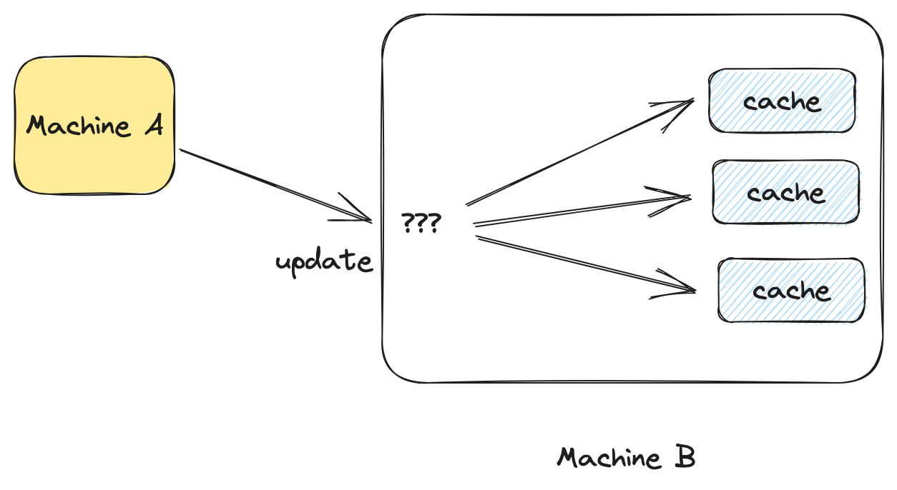

My TV lags. It's driving me crazy. Whenever I touch my remote, I have
to refresh. The same is true about my laptop: I find myself hitting
refresh all the time. What about my phone? Same story. And if I lose
the network? Don't get me started on that.

Why can't it just work? Why do I have to refresh? Ever? Everything is
connected these days. Everything should be kept in sync at all times.
We have the hardware to do it, so why don't we?

The answer is simple. We simply don't have the tools to do it. To keep
things in sync the client would have to send updates to the server,
the server would have to do the same with its services and eventually
circle back to the client. That's a lot of updates! It's a sea of
updates! And unfortunately, we don't have the tools to navigate that
sea.

## Messages

Our industry is obsessed with messages. You can find all sorts of
tools to work with streams of messages. You can do it in any language,
on the platform of your choosing.

But messages are just a mean to an end. Of course, any app using the
network will have to send messages at some point. But if your strategy
involves sending messages from point A to point B, while trying to
devise the logic to update your state, you are going to get it
wrong. Why?  Because changing your state is tough. It has been known
to be tough for a long time. It's called cache invalidation.



## Cache Invalidation (aka: the programmer's nightmare)

Imagine you are the one writing the code that invalidates the caches,
after all, a cache is just a special kind of state, where the state is
a result of a computation. So how would you do it?

Well ... to effectively program the cache invalidation logic, you need
to hold all the possible states of the program in your head. Why?
Because you don't know which pieces of cache (or state), depend on
each-other. In a distributed system, the problem multiplies, as you
have to manage states across multiple machines.

Clearly, this is an impossible task, and that's why cache invalidation
has such a bad reputation. So what's the solution? The solution is to
think about the problem differently.

## Freezing time

Ever wondered why spreadsheets are so popular? Their secret is their
declarative nature. Users simply establish links between cells, and
updates are taken care of automatically. Reactive programming (RP) is
an extension of the spreadsheet concept. You write your logic as if
the program was initializing, pretending time was frozen. When
something changes, the system figures out the shortest way to move
from the old to the new state.

React.js, another instance of reactive programming, works the exact
same way. Your job is to write the rendering logic pretending the
program was initializing, the rest is taken care of for you. Whether
you are writing a formula in a spreadsheet, or writing the rendering
function of a react app, what you are doing in both cases is
pretending that the program is initializing, ignoring changes: **you
are pretending that time is frozen**. That's **Reactive Programming
(RP)**.

This concept is very powerful because it turns state management (and
cache invalidation) into tracktable problems. What if all your caches
were defined with RP? Your caches would update automatically. Isn't
that exactly what we want?  Why stop there?  What if we extended the
principles of Reactive Programming to other domains, like distributed
systems? With networks full of race conditions and concurrent updates,
they seem like a prime candidate for reactive programming.

Turns out, that's precisely what we're aiming to achieve at
[SkipLabs](https://skiplabs.io/). But before we get into that, let's
take an example.

## An Example

Your friend has an online store selling magic the gathering cards. He
is using typical e-commerce web based solution. Although the site is
popular, he realizes that some of his cards are very rare, and that he
would be better off by auctioning them. He comes to you, asking what
it would take to add an auctioning system to his website, but there is
a catch: he doesn't want people to have to constantly hit refresh for
the prices to update.

You immediately start thinking about it. What happens when a user is
bidding? We send a message to the server, the server then updates the
price, and then ... That's it! You are doing it again! You are
thinking in terms of messages and updates. Stop right there. You are
doing it wrong. Time to use our newly acquired magic power. Let's
freeze time!

{:width="50%"}{:.centered}

Forget about the network for a second. What would your auction system
look like if it was a spreadsheet running on just one machine?  You
would have 4 columns: itemID/userID/bid/price where the price is a
formula computing the highest bid. Because it's a spreadsheet,
everytime a new bid is inserted, the price updates accordingly. Pretty
easy right?

Now, let's imagine you were given a new kind of spreadsheet, one where
you can mirror columns across the network, and have those columns kept
in sync for you. How would your auction work? You would mirror the
first 3 columns with clients willing to bid (writers) and you would
mirror the last columns for clients who want to know the highest
bidder (readers). Your system would look something like this:


And that's it! When a change occurs on the first client (the writer),
everything propagates! The server receives the change, computes the
new price and then send the updated values to the readers. The meaning
of the program at runtime was derived from a more abstract
specification. We didn't have to concern ourselves with connections,
messages, race conditions etc ... We left those details to the
runtime. All we did is establish relationships between different
pieces of state.

 Of course, such a spreadsheet does not exist, and TBH, copy/pasting
things across machines would not be exactly practical. But you get the
idea: if we could express things in this way, we could greatly
simplify the development of real-time systems.

## SKDB

At SkipLabs, we have designed an embedded database to replicate the
functionality outlined in the distributed spreadsheet scenario, except
that instead of formulas, it uses SQL statements.

SKDB is first of all an SQL database, that can be embedded anywhere,
but what's special about it, is that it allows you to create chains of
database instances connected with each-other. For example, to run our
auction example, we would need an SKDB instance running server-side
(to run the spreadsheet logic) and instances running for each client
(reader and writer). But it's only once they are connected together
that they form a **reactive system**.

Let's try to get our auctioning system running with SKDB. First,
server-side, we need define the schema of the bids.

```sql
CREATE TABLE bids (itemID INTEGER, userID INTEGER, bid INTEGER);
```

The schema corresponds exactly to the first 3 columns of our
spreadsheet. What about the 4th column? The one that was expressed
with a formula. For that, we are going to use a so called "virtual
view". You can think of a virtual view as an SQL statement that is
kept up-to-date at all times.

```sql
CREATE VIRTUAL VIEW prices AS
  SELECT itemID, max(bid) FROM bids GROUP BY itemID
```

This last statement defined a readonly-table called "prices" that will
be updated every-time the table "bids" changes.

That's it for the server-side. Great! Now what's left is to connect
the pieces to the different clients. SKDB is embeddable, which means
it can run inside another program, on pretty much any platform,
including on the web!

Because your friend is running a website, we will need to use the JS
client. Once you have installed and connected the JS client, you will
have an SKDB instance running directly in your browser, with all the
SQL requests running locally. Now, the interesting part: remember when
we were copy/pasting columns across the network in our imaginary
spreadsheet?  There is a mechanism just like that in SKDB. It's called
mirrorTable.

```js
skdb.server().mirrorTable("bids");
```

And just like that, your local instance of SKDB (the one that
runs in your browser), has now a copy identical to the one that is
running on the server. The semantics is exaclty the same as in the
previous spreadsheet example. Except that we are using SQL to access
and modify the system. Concretly, that means that if a client writes
into the table "bids", that change will be sent to the server and the
server will then recompute the prices accordingly.

That's it for writers. What about readers? The mechanism is very
similar, but instead of ```mirrorTable```, we use something called ```mirrorView```.

```js
skdb.server().mirrorView("prices");
```

The same thing happened. The table "prices" is now available
locally. The only difference between ```mirrorTable``` and
```mirrorView``` is that ```mirrorView``` produces readonly tables.

Finally, to tie it all together, you will need something that notifies
you when something changed, otherwise, how are you going to refresh
your UI? There is a mechanism for that too, it's called ```subscribe```.

```js
skdb.subscribe('prices', change => updateUI(change));
```

Every time a change occurs on the table "prices", the closure you
passed will be called (in this case to refresh the UI).

Done! You just implemented your first reactive system! Congrats!