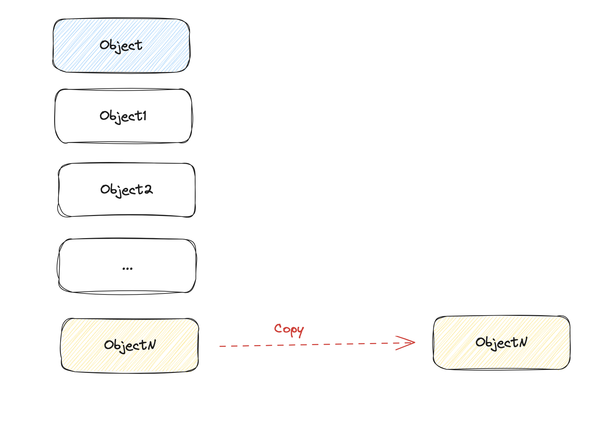

## Choosing the Right Memory Model for Reactive Systems

Reactive systems, known for responding to changes in real-time,
necessitate efficient memory management to ensure optimal
performance. If you're wondering which memory model to choose for your
reactive system, let's delve into the three primary models and assess
their strengths and limitations.

### Malloc and Free (the Stone Age)

{:width="50%"}{:.centered}

The `malloc` and `free` memory model offers a manual approach to
dynamic memory management, granting developers direct control over
memory allocation and deallocation. One of the primary advantages of
this system is its efficiency.

Since developers allocate only what's necessary, it can be tailored to
specific requirements, potentially leading to optimal memory
usage. Moreover, with advancements over time, past fragmentation
issues linked to this model have been largely mitigated.

However, this manual control is a double-edged sword. The biggest
drawback lies in the potential for human error. Developers might
inadvertently forget to release memory, leading to memory leaks, or
they might free memory that's still in use, resulting in memory
corruption. These pitfalls necessitate additional tools and vigilance
to prevent memory-related issues, making the process less convenient
than automated systems like garbage collection.

### Reference Counting

Reference counting serves as an intermediary memory management
technique, automatically tracking the number of references to an
object in memory. On the upside, it offers determinism in object
deallocation: once an object's reference count drops to zero, it is
immediately reclaimed, eliminating some unpredictabilities associated
with garbage collection.

Moreover, reference counting can be more efficient than garbage
collection in scenarios where memory needs to be reclaimed
promptly. However, reference counting isn't without its
shortcomings. It struggles with cyclic references, where two or more
objects reference each other, preventing their counts from ever
reaching zero and thus leading to memory leaks unless augmented with
weak pointers or other mechanisms.

Furthermore, the necessity to increment and decrement reference
counts, especially in multithreaded environments, can introduce
performance overheads, particularly when shared resources are
continually accessed.

But more importantly, reference counting is less than ideal when
dealing with immutable data structures. Let's take an example. Imagine you have an immutable object that holds a count.

```javascript
  myObject = { count: 23, ...};
```

Now, that object is threaded around, and different methods need to
update that count. Because the object is immutable, a new version of
the object will be created every time.

```javascript
  myObject1 = { count: 24, ...};
  myObject2 = { count: 25, ...};
  ...
  myObjectN = { count: 105, ...};
```

What's likely to happen is that only the last object will survive. So
what's happening memory-wise?

{:.centered}

As you can see, we are creating a lot of garbage. Unfortunately, in a
reference counting scheme, that garbage needs to be freed, one by one,
which is not very efficient. There is a better way!

### Tracing Collector

Tracing collectors, commonly known as garbage collectors (GCs), are
memory management tools that reclaim memory by tracing and identifying
objects no longer reachable from the root set. A notable advantage of
tracing collectors is the significant reduction of manual memory
management burdens on the programmer.

Another advantage is that it's a very efficient scheme when
manipulating immutable objects. Let's revisit our example, but this
time, using a GC.

{:.centered}

Only the last surviving object is copied! Which is exactly what we
want when dealing with a lot of immutable objects. However, tracing
collectors are not without their downsides. One of the biggest issues
is the unpredictability of GC pauses.

During garbage collection, application execution might halt, which can
be problematic for real-time or highly responsive systems (such as
reactive systems).

Even with generational garbage collection, which aims to reduce the
frequency of full heap scans, there remains the inevitability of
occasionally lengthy GC cycles that can impact application
responsiveness.

## SKIP's Memory Model

SKIP's memory model has an approach to memory management perfectly
tailored for reactive programming. It uses reference counting for
long-lived objects, and a tracing collector for the short-lived ones.

Long-lived objects are stored in the so-called Shared Heap, using a
reference counting scheme. The type system guarantees statically that
those objects are immutable and do not have cycles.

When an update occurs, SKIP uses a tracing collector for the objects
that were allocated during the update. The collector stops whenever
it hits an object that lives in the Shared Heap. This guarantees that
the GC pause time remains reasonable, because the GC will never visit
more objects than what was allocated during an update. Given that
updates are relatively short (to keep the program responsive), the GC
typically only visits objects that live in a fast cache (L1/L2), and
therefore has minimal overhead.

## The Role of the Type System

SKIP's type system is essential. It ensures object immutability, which
is vital for the memory model to work. Without this type system
verifying immutability, the model wouldn't work. This is why,
unfortunately, the Skip memory model probably cannot be reused for a
different language.

## Conclusion

In summary, the right memory model for reactive programming combines
different techniques, reference counting for its predictability, and
tracing collectors for its efficiency with immutable
data structures.

{:width="100%"}{:.centered}
